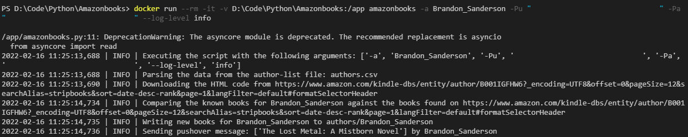

<h1 align="center">Amazon author check</h1>
<h4 align="center">A fully automated tool for scraping the amazon author page and sending alers when new books are available</h4>




# Features

- Support for Pushover notifications
- Support for custom author list
- Support for single and all authors
- Support for custom author folder

---

# Description

A simple All-In-One python script to scrape information from the amazon author pages and comparing this to known local data. 

# Installation

```
$ pip3 install -r requirements.txt
```

# Docker Support

```shell
git clone https://github.com/jopbakker/amazonbooks_python.git
cd amazonbooks_python-scan
sudo docker build -t amazonbooks .
```

# Usage

```python
$ python3 amazonbooks.py -h
usage: amazonbooks.py [-h] [--log-level LOG_LEVEL] [-a CHECK_AUTHOR] [-aL AUTHOR_LIST] [--author-file-folder AUTHOR_FILES_FOLDER] -Pu USER_TOKEN -Pa API_TOKEN

options:
  -h, --help            show this help message and exit
  -a CHECK_AUTHOR, --author CHECK_AUTHOR
                        Custom author check - [Default: all]
  -aL AUTHOR_LIST, --author-list AUTHOR_LIST
                        Custom filename for the csv file containing authors and urls - [Default: authors.csv]
  --author-file-folder AUTHOR_FILES_FOLDER
                        Custom authors file location - [Default: authors]
  --log-level LOG_LEVEL
                        Set the level of logs to show (Options: DEBUG, INFO, WARNING, ERROR, CRITICAL) - [Default: WARNING]

required named arguments:
  -Pu USER_TOKEN, --pushover-user-token USER_TOKEN
                        Pushover user token
  -Pa API_TOKEN, --pushover-api-token API_TOKEN
                        Pushover API token
```

## Looking up a single author
**Native**
```shell
python3 amazonbooks.py -a Brandon_Sanderson -Pu "<Pushover user key>" -Pa "<Pushover API key>"
```

**Docker**
```shell
docker run --rm -it -v ${PWD}:/app amazonbooks -a Brandon_Sanderson -Pu "<Pushover user key>" -Pa "<Pushover API key>"
```

## Looking up all authors (default)
**Native**
```shell
python3 amazonbooks.py -Pu "<Pushover user key>" -Pa "<Pushover API key>"
```

**Docker**
```shell
docker run --rm -it -v ${PWD}:/app amazonbooks -Pu "<Pushover user key>" -Pa "<Pushover API key>"
```

# License
The project is licensed under MIT License.